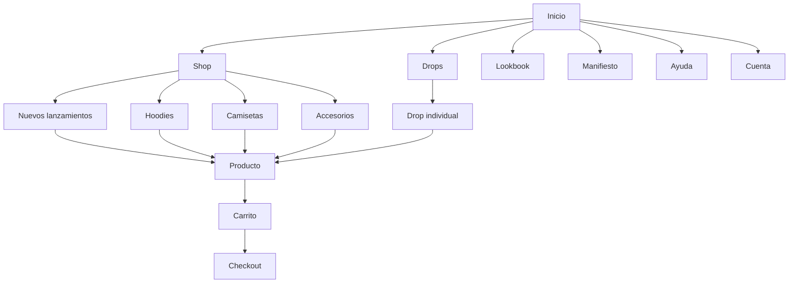
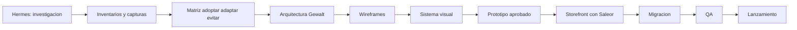

# Plan de reestructura digital de Gewalt

## Objetivo

Reconstruir [gewaltoficial.shop](https://gewaltoficial.shop/) con la sofisticacion editorial, navegacion y experiencia comercial de [Nude Project](https://nude-project.com/es), pero con identidad, contenido, activos y componentes originales de Gewalt.

La referencia sera fiel en ritmo visual, arquitectura, interaccion y experiencia, no una copia literal de codigo, imagenes, textos, tipografias propietarias o elementos distintivos.

## Diagnostico inicial

| Aspecto | Nude Project | Gewalt actual |
|---|---|---|
| Plataforma | Shopify | WordPress/WooCommerce |
| Catalogo | Amplio, segmentado por categorias y colecciones | Tres productos principales |
| Navegacion | Megamenu visual y campanas | Inicio y contacto |
| Compra | Catalogo, PDP, carrito y checkout | Compra parcialmente orientada a WhatsApp |
| Comunicacion | Editorial, campanas y drops | Descripcion basica de productos |
| Contenido | Colecciones, tiendas, membresia y soporte | Productos, testimonios y redes |
| Oportunidad | Referencia de UX y direccion editorial | Crear una identidad comercial mas solida |

## Principios

- Adoptar patrones generales de navegacion, composicion y conversion.
- Adaptar la densidad al catalogo real de Gewalt.
- Evitar secciones vacias copiadas solo porque existen en Nude Project.
- Utilizar fotografias, videos, textos, iconos y animaciones propios.
- Mantener el caracter urbano y limitado de Gewalt.
- Disenar mobile-first.
- Conectar el storefront con Saleor como backend headless.
- No descargar ni reutilizar codigo, imagenes, fuentes o textos de Nude Project.

## Fase 1: Reconocimiento con Hermes

Hermes debe navegar ambos sitios en una sesion limpia y registrar cada evidencia con URL, fecha, viewport y estado.

### Viewports

| Dispositivo | Tamano |
|---|---:|
| Desktop grande | 1440 x 1000 |
| Laptop | 1280 x 800 |
| Tablet | 768 x 1024 |
| Movil | 390 x 844 |
| Movil pequeno | 360 x 800 |

### Paginas de Nude Project

| Prioridad | Pagina o estado |
|---|---|
| P0 | Homepage completa |
| P0 | Menu principal abierto |
| P0 | Categoria o coleccion |
| P0 | Ficha de producto |
| P0 | Selector de talla |
| P0 | Carrito vacio y con producto |
| P0 | Checkout hasta antes del pago |
| P1 | Busqueda y resultados |
| P1 | Colecciones editoriales |
| P1 | Soporte, FAQ y contacto |
| P1 | Cuenta y recuperacion de contrasena |
| P2 | Membresia, tiendas y campanas especiales |
| P2 | Estados sin resultados, error y agotado |

### Paginas de Gewalt

- Homepage completa.
- Contacto.
- Cada producto actual.
- Carrito y checkout WooCommerce.
- Navegacion movil.
- Formularios y enlaces a WhatsApp.
- Testimonios y redes sociales.
- Errores visuales, imagenes inseguras HTTP y contenido provisional.

### Capturas requeridas

- Captura completa de cada pagina.
- Captura del primer viewport.
- Menus abiertos.
- Hover de tarjetas.
- Variantes y tallas.
- Producto agotado.
- Carrito lateral.
- Formularios con errores.
- Footer completo.
- Videos breves de interacciones y animaciones.
- Registro de tiempos percibidos y problemas de carga.

### Convencion de archivos

```text
/research
  /nude-project
    /desktop
    /mobile
  /gewalt-current
    /desktop
    /mobile
  /flows
  /diagrams
  /inventories
```

```text
{sitio}__{pagina}__{viewport}__{estado}__{fecha}.png
```

Ejemplo:

```text
nude__product-detail__390x844__size-selector-open__2026-07-14.png
```

## Datos permitidos

Hermes puede registrar:

- Sitemap y URLs publicas.
- Titulos, jerarquia de encabezados y metadatos.
- Categorias y tipos de pagina.
- Ratios de imagenes.
- Orden y funcion de las secciones.
- Comportamientos de menu, filtros y carrito.
- Patrones de movimiento.
- Estados responsive.
- Tecnologias observables publicamente.

Hermes no debe reutilizar:

- Fotografias o videos.
- Codigo fuente propietario.
- Textos comerciales.
- Archivos de fuentes.
- Iconografia identificable.
- Logos o elementos de marca.
- Datos personales o informacion de clientes.

Debe respetar `robots.txt`, terminos de uso y limites razonables de solicitudes.

## Prompt maestro para Hermes

```text
Analiza https://nude-project.com/es como referencia UX y
https://gewaltoficial.shop/ como sitio objetivo de reestructura.

Objetivo:
Documentar patrones generalizables de arquitectura, navegacion,
composicion editorial, catalogo, producto, carrito y checkout.
No copies ni descargues codigo, imagenes, textos, fuentes, logos
o activos protegidos.

Para cada pagina:
1. Registra URL, fecha, viewport y estado.
2. Captura pagina completa y primer viewport.
3. Enumera secciones en orden.
4. Describe layout, grid, espaciado, jerarquia y ratios de imagen.
5. Registra navegacion y acciones disponibles.
6. Captura estados hover, abierto, vacio, error y movil.
7. Identifica patrones adoptar, adaptar y evitar.
8. Guarda resultados usando:
   {sitio}__{pagina}__{viewport}__{estado}__{fecha}.png

Recorridos obligatorios:
- Home -> coleccion -> producto -> talla -> carrito -> checkout.
- Home -> menu -> categoria -> filtro -> producto.
- Busqueda con resultados y sin resultados.
- Cuenta -> login -> recuperacion.
- Navegacion movil completa.

Genera:
- sitemap-current.md
- sitemap-reference.md
- page-inventory.csv
- component-inventory.csv
- interaction-inventory.csv
- comparison-matrix.md
- critical-flows.mmd
- findings.md
```

## Fase 2: Matriz de referencia

Cada hallazgo debe clasificarse:

| Patron | Decision | Adaptacion Gewalt |
|---|---|---|
| Hero editorial inmersivo | Adoptar | Campana original Gewalt |
| Megamenu con imagenes | Adaptar | Menu reducido mientras el catalogo sea pequeno |
| Colecciones por temporada | Adoptar | Drops limitados de Gewalt |
| Carrito lateral | Adoptar | Integrado con Saleor |
| Navegacion Hombre/Mujer | Evitar inicialmente | No usar sin suficiente catalogo |
| Membresia | Fase futura | Solo despues de validar recurrencia |
| Tiendas fisicas | Evitar | No mostrar si no existen |
| Private Sale | Fase futura | Activar cuando haya promociones reales |
| WhatsApp como compra principal | Reducir | Mantener como soporte, no como checkout |

## Fase 3: Identidad Gewalt

Antes de disenar se necesita:

- Logo vectorial y variaciones.
- Paleta oficial.
- Tipografias autorizadas.
- Manual de marca, si existe.
- Fotografias originales en alta resolucion.
- Videos verticales y horizontales.
- Catalogo, SKU, tallas, stock y precios.
- Politicas de envio, cambios y devoluciones.
- Historia y manifiesto de marca.
- Paises, monedas y metodos de pago.
- Acceso a metricas de WooCommerce, GA4 y Search Console.

### Direccion visual propuesta

- Base oscura, cruda y editorial.
- Alto contraste con el color distintivo de Gewalt.
- Tipografia display agresiva combinada con una sans funcional.
- Imagenes grandes y producto con fondos consistentes.
- Movimiento corto, fisico y deliberado.
- Menos ornamentacion, mas actitud de marca.
- Drops presentados como capitulos, no como categorias genericas.

## Arquitectura objetivo

```text
Inicio (/)
|-- Shop (/shop)
|   |-- Nuevos lanzamientos (/shop/new)
|   |-- Hoodies (/shop/hoodies)
|   |-- Camisetas (/shop/t-shirts)
|   `-- Accesorios (/shop/accessories)
|-- Drops (/drops)
|   `-- Drop individual (/drops/{slug})
|-- Producto (/products/{slug})
|-- Lookbook (/lookbook)
|-- Manifiesto (/about)
|-- Contacto (/contact)
|-- Ayuda (/help)
|   |-- Preguntas frecuentes (/help/faq)
|   |-- Envios (/help/shipping)
|   |-- Cambios y devoluciones (/help/returns)
|   `-- Guia de tallas (/help/size-guide)
|-- Cuenta (/account)
|-- Carrito (/cart)
`-- Checkout (/checkout)
```



Las categorias deben ocultarse automaticamente si todavia no tienen productos.

## Fase 4: Diseno

### Componentes principales

- Barra promocional.
- Header transparente y solido.
- Menu desktop editorial.
- Drawer movil.
- Hero de imagen o video.
- Tarjetas de campanas.
- Grid de productos.
- Tarjeta con segunda imagen en hover.
- Selector de variantes y tallas.
- Guia de tallas.
- Galeria de producto.
- Informacion desplegable.
- Productos relacionados.
- Carrito lateral.
- Busqueda superpuesta.
- Newsletter.
- Footer de soporte y redes.
- Estados vacios, agotados y de error.

### Entregables de diseno

| Entregable | Contenido |
|---|---|
| Moodboard | Gewalt, fotografia, tipografia y movimiento |
| Tokens | Colores, escalas, radios, sombras y espacios |
| Wireframes | Desktop y movil |
| UI kit | Componentes y estados |
| Prototipo | Home, PLP, PDP, carrito y checkout |
| Motion spec | Duraciones, easing y disparadores |
| Content spec | Textos originales y necesidades fotograficas |

## Fase 5: Integracion con Saleor

La tienda visual debe ser un storefront separado del Dashboard de Saleor.

### Modulos

- Productos y variantes.
- Categorias y colecciones.
- Canales y moneda.
- Inventario.
- Checkout.
- Cupones y promociones.
- Usuarios.
- Pedidos.
- Medios e imagenes.
- Envios.
- Pagos.
- Webhooks.

### Migracion desde WooCommerce

1. Exportar productos, variantes, imagenes y clientes autorizados.
2. Limpiar titulos provisionales y slugs heredados.
3. Crear taxonomia definitiva.
4. Generar SKU consistentes.
5. Importar productos en Saleor.
6. Validar inventario, precios y medios.
7. Crear redirecciones `301`.
8. Verificar pedidos historicos que deban conservarse.
9. Mantener WooCommerce en modo consulta durante la transicion.
10. Cortar trafico solo despues de la validacion.

## Tracer bullets de implementacion

| Orden | Entrega vertical |
|---:|---|
| 1 | Home -> coleccion -> producto real |
| 2 | Producto -> variante -> carrito |
| 3 | Carrito -> checkout -> pedido |
| 4 | Cuenta -> login -> historial |
| 5 | Busqueda, filtros y agotados |
| 6 | Drops y contenido editorial |
| 7 | Soporte, legales y SEO |
| 8 | Analitica, rendimiento y lanzamiento |

Cada entrega debe funcionar en movil y desktop antes de avanzar.

## Validacion

### Funcional

- Navegacion completa.
- Variantes y tallas correctas.
- Stock actualizado.
- Carrito persistente.
- Checkout funcional.
- Emails transaccionales.
- Cupones.
- Cuenta e historial.
- WhatsApp como soporte secundario.

### Calidad

- Lighthouse Performance movil: minimo `85`.
- Accessibility: minimo `95`.
- SEO: minimo `95`.
- Sin errores graves de consola.
- Imagenes AVIF/WebP.
- CLS menor a `0.1`.
- LCP menor a `2.5 s`.
- WCAG 2.2 AA.
- Schema de producto y breadcrumbs.
- Eventos GA4 para todo el embudo.

## Metricas

- Conversion de sesion a compra.
- Visitas a producto.
- Add-to-cart rate.
- Inicio de checkout.
- Abandono de checkout.
- Uso de busqueda.
- Errores por metodo de pago.
- Conversion movil.
- Contactos por WhatsApp.
- Tiempo de carga por plantilla.

## Cronograma sugerido

| Semana | Resultado |
|---:|---|
| 1 | Capturas, inventarios y diagramas de Hermes |
| 2 | Arquitectura, matriz y direccion Gewalt |
| 3 | Wireframes y sistema visual |
| 4 | Prototipo aprobado |
| 5-6 | Storefront base y catalogo Saleor |
| 7 | Checkout, cuenta e integraciones |
| 8 | Migracion, QA y lanzamiento controlado |

## Flujo de trabajo recomendado



## Riesgos y controles

| Riesgo | Control |
|---|---|
| Copia excesiva de Nude Project | Revisar cada componente contra la identidad original de Gewalt |
| Uso de activos protegidos | Utilizar exclusivamente activos propios o licenciados |
| Catalogo insuficiente | Ocultar categorias vacias y priorizar drops |
| Perdida de SEO | Inventario de URLs y redirecciones 301 |
| Migracion incorrecta | Validacion de SKU, stock, precios y pedidos |
| Rendimiento visual deficiente | Presupuestos de imagen, video y JavaScript |
| Alcance creciente | Separar MVP, fase 2 y experimentos futuros |
| Capturas desactualizadas | Registrar fecha, URL, viewport y estado en cada evidencia |

## Criterio final

El resultado debe provocar la sensacion de una marca streetwear editorial al nivel de Nude Project, pero cualquier persona debe reconocerlo inmediatamente como **Gewalt**, no como una copia renombrada de Nude Project.
